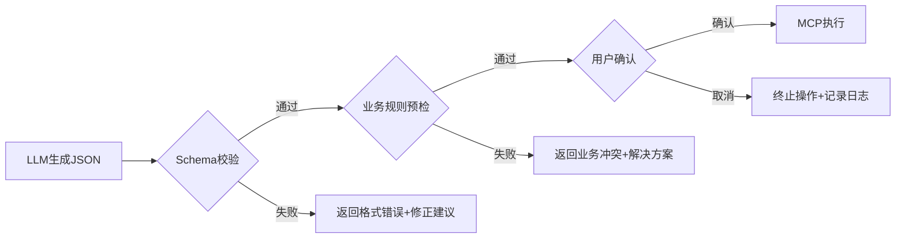
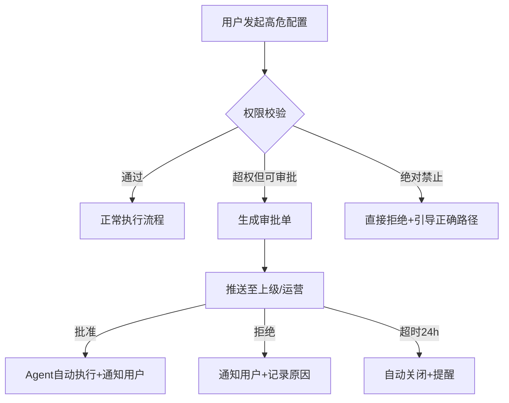

这份产品文档是基于前述 **ToB 商家智能配置助手（Merchant Config Agent）** 架构编写的。它面向产品经理、研发团队及实施交付团队，旨在明确产品边界、功能规格及验收标准。

------

# 📄 产品需求文档：商家智能配置助手 (Merchant Config AI)

| 文档版本     | v1.0                                                   |
| ------------ | ------------------------------------------------------ |
| **产品类型** | ToB SaaS / AI Agent                                    |
| **目标用户** | 品牌运营、区域经理、店长、实施交付人员                 |
| **核心价值** | 降低后台配置门槛、减少人为配置错误、提升连锁管理效率   |
| **关联系统** | 二维火商家后台、连锁管理系统、IoT设备平台、开放平台API |

------

## 1. 产品概述

### 1.1 背景与痛点

当前二维火商家后台功能强大但结构复杂，商家在配置时面临以下痛点：

- **学习成本高**：菜单、营销、设备等模块入口深，字段多，新手上手慢。
- **配置易出错**：价格配错导致资损、打印机绑定错误导致漏单、优惠活动冲突导致客诉。
- **连锁同步难**：多门店差异化配置操作繁琐，缺乏批量校验与回滚机制。
- **依赖人工支持**：大量“怎么配”、“配错了怎么办”的咨询占用客服资源。

### 1.2 产品定位

**Merchant Config AI** 是嵌入商家后台/企微/钉钉的 **ToB 配置型 Agent**。它不是聊天机器人，而是 **“懂业务的虚拟实施顾问”**。通过将自然语言转化为结构化配置指令，并内置业务规则校验，实现安全、准确的自动化配置。

### 1.3 核心原则

- **安全第一**：所有写操作必须经过 Schema 校验 + 业务规则预检 + 用户确认。
- **结构化输出**：LLM 不直接生成 SQL，仅生成符合 API 规范的 JSON/DSL。
- **可追溯性**：全链路审计日志，支持配置快照与一键回滚。
- **渐进式交互**：信息缺失时主动追问/返回表单，而非猜测填充。

------

## 2. 用户角色与权限矩阵

| 角色         | 典型场景                         | 数据范围 | 高危操作权限                               | Agent 能力边界   |
| ------------ | -------------------------------- | -------- | ------------------------------------------ | ---------------- |
| **品牌运营** | 新品上市、全域营销、模板下发     | 全连锁   | ✅ 批量改价/下架 ✅ 创建全域活动             | 全功能           |
| **区域经理** | 区域菜单调整、巡店配置检查       | 管辖区域 | ✅ 区域批量操作 ⚠️ 需审批修改全域模板        | 区域级配置+查询  |
| **店长**     | 本店桌台调整、临时促销、设备重绑 | 单店     | ⚠️ 仅限本店非核心配置 ❌ 禁止改成本价/删类目 | 单店配置+RAG咨询 |
| **实施交付** | 新店初始化、数据迁移、故障排查   | 授权门店 | ✅ 初始化/重置配置 ✅ 设备拓扑重建           | 全功能+调试模式  |

> **注**：Agent 在执行前必须通过 Auth 网关校验 Token 权限，越权请求直接拒绝并记录告警。

------

## 3. 核心 Agent 功能规格

### 3.1 🍽️ 菜单工程 Agent

| 功能点            | 输入示例                                              | 处理逻辑                                                     | 输出/动作                               | 异常兜底                                                 |
| ----------------- | ----------------------------------------------------- | ------------------------------------------------------------ | --------------------------------------- | -------------------------------------------------------- |
| **菜品创建/修改** | “新增‘藤椒鸡’，售价28，归入凉菜类，加‘微麻/特麻’规格” | 1. 解析实体→查分类ID 2. 生成SKU JSON 3. 校验必填项(成本价/图片) 4. 返回预览卡片 | 用户确认后调用 `MenuMCP.create()`       | 缺成本价→弹出补全表单；分类不存在→推荐相似分类或引导新建 |
| **批量调价**      | “所有海鲜类菜品涨价10%”                               | 1. 查询海鲜类目下所有SKU 2. 计算新价格(保留小数规则) 3. 生成变更Diff列表 | 展示变更清单+影响门店数，确认后批量提交 | 超50条→转异步任务；涨幅>30%→触发二次确认                 |
| **规格组管理**    | “给所有烤鱼加一个‘配菜’规格组”                        | 1. 查现有规格组是否重名 2. 创建/复用规格组 3. 批量关联菜品   | 返回关联结果摘要                        | 部分菜品已存在该规格→提示冲突并跳过                      |
| **连锁模板下发**  | “把总部‘夏季新品’模板同步到华东区，但南京店除外”      | 1. 解析区域+例外名单 2. 生成同步策略JSON 3. 预检门店覆盖状态 | 任务ID + 进度推送链接                   | 门店离线/版本过低→标记失败原因，支持重试                 |

### 3.2 🎁 营销策略 Agent

| 功能点       | 关键特性                                   | 安全机制                                                     |
| ------------ | ------------------------------------------ | ------------------------------------------------------------ |
| **活动创建** | NL → 优惠规则结构化（满减/折扣/赠品/时段） | **冲突检测**：自动扫描时间/商品重叠活动，提示优先级调整建议  |
| **试算模拟** | “这个活动预计让利多少？”                   | 调用 `PromoMCP.simulate()` 基于近30天订单测算，返回预估金额区间 |
| **条件排除** | “酒水不参与、会员折上折”                   | 精准映射为 `exclude_category_ids` + `stackable: true`，避免语义歧义 |
| **紧急下线** | “立刻停掉暑期特惠”                         | 软删除 + 缓存即时失效，返回受影响进行中订单数                |

### 3.3 🏪 门店基建 Agent

| 功能点       | 处理要点                        | 验证机制                                        |
| ------------ | ------------------------------- | ----------------------------------------------- |
| **设备绑定** | 型号模糊匹配 + 驱动协议自动识别 | 绑定前 Ping/Telnet 预检，失败阻断并提示网络问题 |
| **打印分区** | “3号包厢凉菜打到后厨2号机”      | 更新 `档口-打印机` + `桌台-分区` 双映射表       |
| **桌台布局** | “大厅加4张2人桌”                | 校验桌台编号唯一性 + 区域容量上限               |
| **营业参数** | “午市延长到14:30”               | 检查是否有预订/排队冲突，提示影响范围           |

### 3.4 📚 RAG 帮助中心 Agent

| 知识类型   | 来源                    | 输出增强                             |
| ---------- | ----------------------- | ------------------------------------ |
| 操作指引   | 《商家后台手册》PDF切片 | 步骤列表 + **DeepLink跳转按钮**      |
| 错误码解析 | 错误码字典 + 历史工单   | 原因说明 + 解决方案 + 相关配置页链接 |
| 行业模板   | 最佳实践库              | “火锅店标准配置包”一键应用入口       |
| API文档    | 开放平台Wiki            | 代码示例 + 参数说明 + 调试工具链接   |
| 版本更新   | 发版日志                | 新功能介绍 + 配置迁移指引            |

------

## 4. 交互设计规范

### 4.1 对话流设计原则

- **信息完整才执行**：缺少必要参数时，返回结构化表单卡片（非纯文本追问）。
- **写操作必预览**：所有创建/修改/删除操作，必须先展示变更预览（Diff View），用户点击“确认”后才执行。
- **异步任务可视化**：批量操作返回任务卡片，含进度条、成功/失败数、查看详情链接。
- **错误可修复**：执行失败时，返回具体错误原因 + 修复建议 + 重试按钮。

### 4.2 UI 组件规范

| 组件                   | 用途                   | 示例                                         |
| ---------------------- | ---------------------- | -------------------------------------------- |
| **ConfigPreviewCard**  | 展示即将执行的配置变更 | 菜品名、原价→新价、影响门店数、确认/取消按钮 |
| **FormCompletionCard** | 补全缺失参数           | 带校验的表单字段（价格/分类/图片上传）       |
| **TaskProgressCard**   | 异步任务状态           | 进度条、日志折叠面板、重试/导出按钮          |
| **ConflictAlertCard**  | 优惠/配置冲突提示      | 冲突活动列表、优先级调整滑块、忽略/调整按钮  |
| **DeepLinkButton**     | RAG 答案中的快捷跳转   | “前往【菜品管理-规格设置】” 按钮             |

------

## 5. 安全与风控机制

### 5.1 三层校验体系



### 5.2 高危操作保护

| 操作类型            | 保护措施                                                |
| ------------------- | ------------------------------------------------------- |
| 批量改价/下架       | >50条转异步+审批流；涨幅>30%二次确认                    |
| 删除类目/菜品       | 软删除 + 回复“确认删除XXX”口令验证                      |
| 营业中改菜单/打印机 | 时段检测(11:00-13:30/17:00-20:00) → 额外警告+店长验证码 |
| 营销活动创建        | 强制试算模拟 + 冲突检测通过才可提交                     |
| 连锁模板覆盖        | 自动生成变更前快照，支持7天内一键回滚                   |

### 5.3 审计日志

每条 Agent 执行记录包含：

- `trace_id` / `timestamp` / `user_id` / `role`
- `intent` / `input_nl` / `generated_json`
- `validation_result` / `user_confirmation`
- `execution_status` / `before_snapshot` / `after_snapshot`
- `error_detail` (if failed)

------

## 6. 技术接口契约（MCP Tools）

| Tool Name                 | 描述         | 输入参数                                            | 输出                                         | 幂等性               |
| ------------------------- | ------------ | --------------------------------------------------- | -------------------------------------------- | -------------------- |
| `menu.create_dish`        | 创建菜品     | `{name, category_id, skus: [...], image_url}`       | `{dish_id, status}`                          | ✅ (by name+category) |
| `menu.batch_update_price` | 批量调价     | `{sku_ids: [], price_rule: "inc_pct|fixed", value}` | `{task_id}`                                  | ✅ (by task_id)       |
| `promo.validate_conflict` | 优惠冲突检测 | `{start_time, end_time, item_ids, discount_type}`   | `{has_conflict, conflicts: [...]}`           | N/A                  |
| `promo.simulate`          | 活动试算     | `{promo_config, sample_orders: []}`                 | `{estimated_discount, affected_order_count}` | N/A                  |
| `iot.bind_printer`        | 绑定打印机   | `{device_model, ip, port, zone_id}`                 | `{bind_id, connectivity_test}`               | ✅ (by ip+port)       |
| `chain.sync_template`     | 连锁模板下发 | `{template_id, target_stores, exclude_stores}`      | `{task_id}`                                  | ✅ (by task_id)       |
| `config.rollback`         | 配置回滚     | `{snapshot_id}`                                     | `{rollback_status}`                          | ✅                    |
| `rag.search`              | 知识库检索   | `{query, doc_types: []}`                            | `{answers: [{text, deep_link, screenshot}]}` | N/A                  |

------

## 7. 上线计划与验收标准

### Phase 1：只读助手 + RAG（MVP）

- **范围**：配置查询 + 操作指引 + 错误码解析
- **验收**：查询准确率 ≥90%；RAG 答案含 DeepLink 率 ≥80%；无写操作风险

### Phase 2：单店安全配置

- **范围**：菜品CRUD + 设备绑定 + 单店营销（含预览/校验）
- **验收**：配置成功率 ≥95%；高危操作拦截率 100%；用户确认率 ≥98%

### Phase 3：连锁批量 + 异步任务

- **范围**：批量调价/下发 + 任务进度 + 回滚
- **验收**：批量任务完成率 ≥99%；回滚成功率 100%；审计日志完整率 100%

### Phase 4：智能推荐 + 主动巡检

- **范围**：配置优化建议 + 异常配置自动检测 + 行业模板推荐
- **验收**：建议采纳率 ≥30%；异常检出率 ≥85%

------

## 8. 附录

### 8.1 术语表

- **MCP**：Model Context Protocol，Agent 调用工具的标准化协议
- **Schema**：配置数据的 JSON Schema 定义，用于格式校验
- **Snapshot**：配置变更前后的完整状态快照，用于回滚
- **DeepLink**：直达商家后台特定页面的 URL，含上下文参数
- **Override Policy**：连锁配置中门店级覆盖总部级的策略

### 8.2 参考文档

- 二维火商家后台 API 文档 v3.2
- 《餐饮SaaS配置错误案例集》
- MCP Tool 开发规范
- RBAC 权限模型设计文档

------

在 ToB SaaS 产品中，尤其是涉及核心经营数据配置的 AI Agent，**权限管理不仅是功能门槛，更是安全底线**。AI Agent 的权限不能简单等同于“用户权限”，必须引入 **“用户 × Agent × 场景”** 的三维动态鉴权模型。

以下是为《二维火商家智能配置助手》补充的详细权限管理制度章节，建议作为产品文档的 **第9章** 或独立安全附件。

------

### 🔐 9. 权限管理与安全控制制度

#### 9.1 设计原则

- **最小权限原则**：Agent 仅拥有完成当前意图所需的最小数据集和操作权限。
- **双重鉴权原则**：所有写操作必须同时通过“用户RBAC校验”和“Agent安全策略校验”。
- **上下文感知原则**：权限随门店、时段、操作风险等级动态升降级。
- **可审计原则**：权限判定过程、拒绝原因、提权审批全链路留痕。

#### 9.2 三维动态权限模型

```text
┌─────────────────────────────────────────────────────┐
│              最终执行权限 = f(U, A, C)               │
│                                                     │
│  U (User)      ×  A (Agent)       ×  C (Context)    │
│  ─────────        ─────────         ─────────────    │
│  • RBAC角色       • 工具白名单       • 目标门店归属   │
│  • 数据范围       • 参数约束         • 当前营业时段   │
│  • 审批额度       • 风险评级         • 操作频次/批量  │
│  • 账号状态       • 兜底策略         • 数据敏感度     │
└─────────────────────────────────────────────────────┘
```

> ⚠️ **核心规则**：即使店长拥有“修改菜品”权限，若 Agent 检测到当前为午高峰且修改涉及全域模板，则自动降级为“仅可查看”或“需上级审批”。

#### 9.3 用户侧 RBAC 权限矩阵（Agent 适配版）

| 角色           | 菜单配置     | 营销配置   | 设备/基建  | 连锁同步     | 数据查询      | RAG咨询 | 高危操作阈值   |
| -------------- | ------------ | ---------- | ---------- | ------------ | ------------- | ------- | -------------- |
| **超级管理员** | ✅ 全量       | ✅ 全量     | ✅ 全量     | ✅ 全量       | ✅ 全量        | ✅       | 无限制         |
| **品牌运营**   | ✅ 模板+全域  | ✅ 全域活动 | ⚠️ 仅查看   | ✅ 区域下发   | ✅ 全域        | ✅       | 批量≤200条     |
| **区域经理**   | ✅ 管辖区域   | ✅ 区域活动 | ⚠️ 管辖区域 | ⚠️ 区域内同步 | ✅ 区域        | ✅       | 批量≤50条      |
| **店长**       | ✅ 本店非核心 | ✅ 本店临时 | ✅ 本店     | ❌ 禁止       | ✅ 本店        | ✅       | 单条/日限10次  |
| **店员/收银**  | ❌            | ❌          | ❌          | ❌            | ⚠️ 仅订单/桌台 | ✅       | 无             |
| **实施交付**   | ✅ 授权门店   | ✅ 授权门店 | ✅ 授权门店 | ✅ 授权门店   | ✅ 授权        | ✅       | 初始化模式豁免 |

**字段说明**：

- ✅ = Agent 可直接执行（经预览确认）
- ⚠️ = Agent 需额外校验或触发审批流
- ❌ = Agent 直接拒绝并返回引导话术
- “非核心”指排除成本价、删除类目、停用必点菜等

#### 9.4 Agent 侧安全策略层

Agent 在执行 MCP Tool 前，必须通过以下策略引擎校验：

| 策略维度         | 规则示例                                        | 触发动作                            |
| ---------------- | ----------------------------------------------- | ----------------------------------- |
| **工具白名单**   | 店长角色 Agent 不可调用 `chain.sync_template`   | 拒绝 + 提示“请联系运营处理连锁配置” |
| **参数边界**     | 单次调价幅度 ≤50%；活动折扣 ≥3折                | 超限 → 转审批流                     |
| **时段保护**     | 11:00-13:30 / 17:00-20:00 禁止改打印机/菜单结构 | 阻断 + 提示“营业高峰期，请错峰操作” |
| **频次限流**     | 同一用户1分钟内配置请求 ≤5次                    | 触发验证码 / 临时锁定               |
| **数据隔离**     | 区域经理查询时自动注入 `region_id` 过滤条件     | 静默过滤，不暴露其他区域数据        |
| **敏感字段脱敏** | 查询会员信息时手机号/身份证自动掩码             | 返回 `138****1234`                  |
| **异常行为检测** | 短时间内大量删除菜品/修改价格                   | 熔断 Agent + 告警安全团队           |

#### 9.5 审批与提权机制

当操作超出当前权限但业务合理时，支持**异步审批流**：



**审批单内容必须包含**：

- 操作人 + 原始自然语言指令
- Agent 解析后的结构化配置预览
- 影响范围（门店数/菜品数/预估金额）
- 风险评级（高/中/低）+ 冲突检测结果
- 一键批准/拒绝按钮 + 备注栏

#### 9.6 数据隔离与租户安全

| 层级       | 隔离策略          | Agent 实现方式                                               |
| ---------- | ----------------- | ------------------------------------------------------------ |
| **租户级** | 严格物理/逻辑隔离 | 所有 MCP 调用强制携带 `tenant_id`，网关层校验 Token 归属     |
| **门店级** | 行级数据过滤      | Agent 生成查询时自动注入 `store_id` 条件；连锁操作需显式指定目标门店列表 |
| **字段级** | 敏感字段访问控制  | 成本价、供应商联系方式等字段仅特定角色可见；Agent 输出前做字段级过滤 |
| **会话级** | 上下文不跨店      | 多轮对话中切换门店需重新确认；禁止在A店会话中操作B店数据     |

#### 9.7 审计与合规

**9.7.1 日志规范**
每条权限判定日志包含：

```json
{
  "trace_id": "uuid",
  "timestamp": "ISO8601",
  "user_id": "U12345",
  "user_role": "store_manager",
  "agent_intent": "menu.batch_update_price",
  "target_stores": ["S001", "S002"],
  "permission_check": {
    "rbac_result": "allowed",
    "policy_result": "denied",
    "deny_reason": "peak_hour_protection",
    "final_decision": "require_approval"
  },
  "approval_id": "APR-20260720-001", // 如触发审批
  "execution_status": "pending_approval"
}
```

**9.7.2 定期审查**

- **月度**：导出 Agent 权限拒绝/审批记录，分析权限设置合理性
- **季度**：Review 角色权限矩阵，清理离职人员/过期实施账号
- **事件驱动**：发生配置事故后，立即回溯相关 Agent 权限链路

#### 9.8 应急响应

| 场景           | 响应措施                                   | 恢复时间目标 |
| -------------- | ------------------------------------------ | ------------ |
| Agent 越权执行 | 立即熔断该 Agent + 回滚配置 + 告警安全团队 | < 5分钟      |
| 权限服务故障   | 降级为“只读模式”+ 提示“权限校验暂不可用”   | < 1分钟      |
| 疑似账号泄露   | 冻结账号 + 强制登出所有会话 + 重置Token    | < 2分钟      |
| 审批流阻塞     | 自动升级至超级管理员 + 短信/电话告警       | < 10分钟     |

------

### 📎 附录：权限配置后台需求

为支撑上述制度，需在商家后台新增 **「AI Agent 权限管理」** 模块：

| 功能               | 描述                                          | 优先级 |
| ------------------ | --------------------------------------------- | ------ |
| 角色-Agent权限映射 | 可视化配置各角色可用的 Agent 及工具白名单     | P0     |
| 安全策略编辑器     | 可视化配置时段保护、批量阈值、敏感字段等规则  | P0     |
| 审批流配置         | 设置不同操作的审批人、超时策略、通知渠道      | P1     |
| 权限审计看板       | 展示权限拒绝率、审批通过率、高频操作排行      | P1     |
| 应急熔断开关       | 一键禁用 Agent 写操作 / 禁用特定 Agent        | P0     |
| 模拟测试工具       | 输入角色+指令，预览权限判定结果（不真实执行） | P2     |

------

> **制度生效说明**：本权限管理制度自产品上线之日起生效，所有 Agent 开发、测试、运维均需严格遵守。制度修订需经安全委员会评审，重大变更提前7个工作日通知商家。